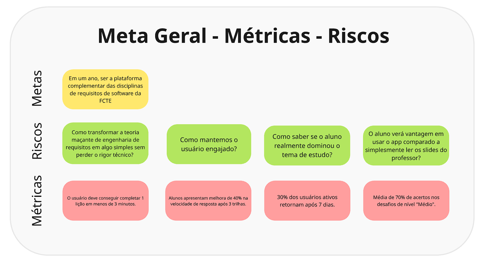
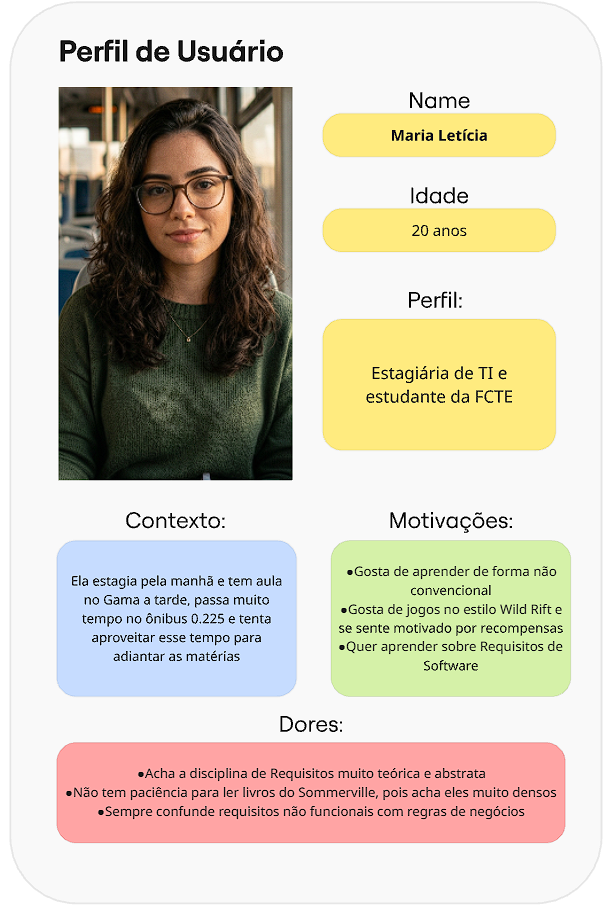
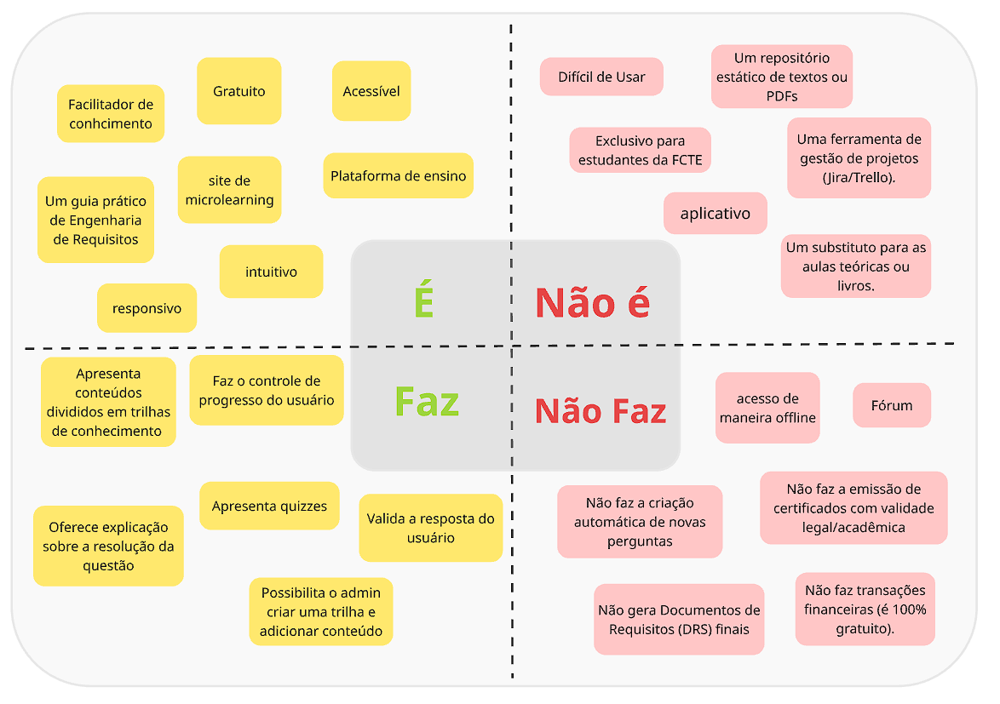
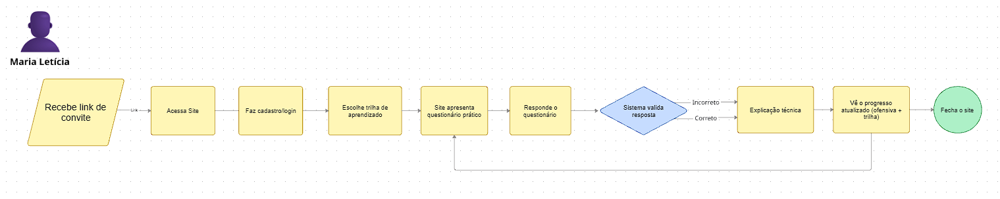

# Mapping

## 1. Introdução

O **Mapping** é a primeira etapa do **Design Sprint**, metodologia desenvolvida pela Google Ventures (GV) com o objetivo de responder a questões críticas de produto em apenas cinco dias por meio de prototipação e testes com usuários reais (Knapp; Zeratsky; Kowitz, 2016). Nessa fase inicial, a equipe busca construir um entendimento compartilhado do problema, alinhando perspectivas, definindo o público-alvo e mapeando a jornada que o usuário percorre ao interagir com o produto.

O Mapping combina diferentes atividades estruturadas (como a definição de princípios, metas, riscos e métricas) para garantir que toda a equipe parta de um mesmo ponto antes de avançar para as etapas de ideação e prototipação. Segundo a metodologia da Google Ventures, o mapeamento da jornada do usuário é fundamental para identificar o momento crítico em que o produto deve intervir, tornando o problema concreto e solucionável dentro do sprint.

## 2. Metodologia

A etapa de Mapping foi realizada de forma remota através da plataforma Microsoft Teams, com suporte visual do Miro, em duas sessões que totalizaram aproximadamente 5 horas. O processo foi dividido entre o entendimento teórico da metodologia e a aplicação prática no projeto. A dinâmica foi estruturada nos seguintes momentos:

- **Sessão 1:** Alinhamento e Definição de Escopo
O foco inicial foi o nivelamento da equipe sobre os conceitos do Design Sprint. Através de uma discussão aberta, o grupo definiu os objetivos de longo prazo e as perguntas críticas do projeto, focando nos desafios pedagógicos da Engenharia de Requisitos.

- **Sessão 2:** Ideação e Construção de Artefatos
Nesta etapa, a equipe partiu para a ideação colaborativa no Miro. De forma espontânea e iterativa, os membros levantaram propostas para estruturar os seguintes artefatos: Basics, Persona, Matriz Core, Fluxo, HMW

## 3. Papéis dos Membros

A condução da etapa de Mapping foi estruturada com papéis definidos, conforme a metodologia do Design Sprint, que prevê a figura do **Facilitador**, responsável por manter o grupo focado e produtivo, e do **Timekeeper**, responsável pelo controle do tempo das atividades (Knapp; Zeratsky; Kowitz, 2016).

**Tabela 1:** Papéis dos Membros da Equipe

| Membro | Papel |
|---|---|
| **Yan Matheus** | Facilitador: Responsável por guiar e conduzir as atividades. |
| **Arthur Evangelista** | Decisor e Facilitador: Responsável pela palavra final nas decisões de escopo e pela condução das dinâmicas. |
| **Yasmin** | Timekeeper: Responsável por garantir o cumprimento dos prazos, controlando o tempo de cada atividade. |
| **Demais membros** | Participantes ativos: contribuíram com ideias, demandas e perspectivas para o desenvolvimento dos artefatos. |

*Fonte: elaborado pelos autores (2026).*

> **Nota:** Todos os membros da equipe foram corresponsáveis pela **revisão dos artefatos** produzidos nesta etapa do Design Sprint.

## 4. Princípios do Produto

Os princípios do produto funcionam como diretrizes norteadoras que orientam as decisões de design, desenvolvimento e conteúdo ao longo de todo o projeto. Eles expressam os valores fundamentais que a equipe se compromete a preservar em cada funcionalidade e interação da plataforma, servindo como critério de avaliação para qualquer escolha que impacte a experiência do usuário (Knapp; Zeratsky; Kowitz, 2016).

### 4.1 Linguagem Simples
O conteúdo da plataforma deve ser apresentado de forma clara e acessível, garantindo que qualquer estudante, independentemente de seu nível de familiaridade com Engenharia de Requisitos, consiga compreender os conceitos abordados sem necessidade de conhecimento prévio aprofundado.

### 4.2 Feedback Contínuo
O usuário não pode encerrar um exercício sem ter conhecimento pleno de onde errou e por quê. Toda resposta, correta ou incorreta deve ser acompanhada de uma explicação que reforce o conceito técnico no momento exato da dúvida, transformando o erro em oportunidade de aprendizagem.

### 4.3 Microlearning
O conteúdo deve ser estruturado em unidades pequenas e autossuficientes, organizadas por temas específicos e consumíveis em sessões de até 5 minutos. Essa abordagem respeita o tempo e o contexto do estudante, favorecendo a consistência nos estudos (Hug, 2005).

### 4.4 Engajamento
A plataforma deve manter o usuário motivado e interessado por meio de estratégias de engajamento, como ofensivas por exemplo, garantindo que o retorno frequente à plataforma seja uma experiência recompensadora e não uma obrigação.

## 5. Basics — Fundamentos Adotados

Os *Basics* correspondem à definição dos fundamentos estratégicos do sprint: a **meta de longo prazo**, os **riscos** identificados e as **métricas** de sucesso. Essa etapa, inspirada nas perguntas-chave do Design Sprint ("*Por que estamos fazendo este projeto?*" e "*O que pode dar errado?*"), alinha a equipe em torno de um objetivo comum antes do mapeamento da jornada (Knapp; Zeratsky; Kowitz, 2016). É possível observar a Meta, Riscos e Métricas na Figura 1.

### 5.1 Meta

Foi estabelecido a meta de: Em um ano, ser a plataforma complementar das disciplinas de requisitos de software da FCTE

### 5.2 Riscos

- 1. Como transformar a teoria maçante de engenharia de requisitos em algo simples sem perder o rigor técnico?
- 2. Como mantemos o usuário engajado?
- 3. O aluno verá vantagem em usar o app comparado a simplesmente ler os slides do professor?
- 4. Como saber se o aluno realmente dominou o tema de estudo?

### 5.3 Métricas

- 1. O usuário deve conseguir completar 1 lição em menos de 3 minutos.
- 2. 30% dos usuários ativos retornam após 7 dias.
- 3. Alunos apresentam melhora de 40% na velocidade de resposta após 3 trilhas.
- 4. Média de 70% de acertos nos desafios.

<b> Figura 1:</b> Meta, Riscos e Métricas

*Fonte: elaborado pelos autores (2026).*

## 6. Map (Mapeamento)

### 6.1 Público-Alvo (Persona)

A persona definida pela equipe é **Maria Letícia**, 20 anos, estudante de Engenharia de Software na FCTE/UnB e estagiária de TI. Ela estuda à tarde no campus do Gama e estagia pela manhã, passando boa parte do dia no ônibus 0.225, tempo que tenta aproveitar para adiantar as matérias. Maria Letícia se identifica com aprendizado não convencional e se sente motivada por sistemas de ofensiva tendo jogos como Wild Rift como referência. Sua principal frustração com a disciplina de Requisitos de Software é o caráter excessivamente teórico e abstrato do conteúdo, agravado pela densidade dos materiais tradicionais como o Sommerville. Uma dificuldade técnica recorrente é a confusão entre requisitos não funcionais e regras de negócio, lacuna que a plataforma endereça diretamente por meio de seus desafios de classificação.

<b> Figura 2:</b> Persona - Maria Letícia

*Fonte: elaborado pelos autores (2026).*

### 6.2 Matriz Core: É / Não É / Faz / Não Faz

A **Matriz Core** (também conhecida como *É / Não É / Faz / Não Faz*) é uma ferramenta de alinhamento que delimita o escopo do produto, deixando explícito o que ele representa e o que está fora de seus propósitos. Ela evita escopo aberto e garante que a equipe tenha uma definição consensual do produto antes de avançar para o design (Gray; Brown; Macanufo, 2010). A Figura 3 demonstra a Matriz Core criada pela equipe:

<b> Figura 3:</b> Matriz Core

*Fonte: elaborado pelos autores (2026).*

### 6.3 Fluxo do Usuário

O fluxo do usuário mapeia a jornada completa percorrida pelo estudante, desde o primeiro contato com a plataforma até o encerramento da sessão. Esse mapeamento é central no Design Sprint pois identifica o **momento crítico** da experiência, ou seja, o ponto em que o produto precisa ser mais eficaz para gerar valor (Knapp; Zeratsky; Kowitz, 2016).

<b> Figura 4:</b> Fluxo do Usuário

*Fonte: elaborado pelos autores (2026).*

## 7. Como Poderíamos? (*How Might We*)

O **Como Poderíamos?** (*How Might We* (HMW)) é uma técnica do Design Sprint que transforma desafios e riscos identificados no Mapping em perguntas abertas de design. A lógica é simples: em vez de encarar um problema como obstáculo, a equipe o reformula como uma oportunidade de criação: "como *poderíamos* resolver isso?" (Knapp; Zeratsky; Kowitz, 2016). As perguntas HMW alimentam diretamente a etapa seguinte do sprint (Sketch), pois abrem espaço para múltiplas soluções sem pressupor uma resposta específica.

As perguntas levantadas pela equipe foram:

- **Como poderíamos** transformar o conteúdo técnico de Engenharia de Requisitos em algo simples e acessível sem perder o rigor conceitual?
- **Como poderíamos** manter o usuário engajado ao longo do tempo, garantindo que ele retorne à plataforma com regularidade?
- **Como poderíamos** tornar a plataforma mais vantajosa para o aluno do que simplesmente rever os slides da disciplina?
- **Como poderíamos** verificar se o aluno realmente dominou um tema de estudo, e não apenas decorou as respostas?
- **Como poderíamos** alcançar estudantes que buscam se aprofundar em Engenharia de Requisitos e conectá-los à plataforma?
- **Como poderíamos** facilitar a compreensão prática dos conceitos de requisitos por meio de exercícios contextualizados?
- **Como poderíamos** elevar o engajamento do usuário com mecanismos de progresso visível e feedback imediato?

## 8. Conclusão

A etapa de Mapping cumpriu seu papel de alinhar a equipe em torno do problema, da persona, do escopo e das diretrizes que orientam o produto. Os artefatos produzidos consolidaram uma visão compartilhada sobre o desafio enfrentado pelo público-alvo e organizaram os principais pontos que precisavam ser tratados nas fases seguintes do sprint.

Com esse entendimento estruturado, a equipe avançou para a fase de [Sketch](https://unbarqdsw2026-1-turma01.github.io/Grupo02_ConhecendoRequisitos_Entrega01/#/Base/1.1.2.Sketch), na qual os insights levantados em Mapping foram transformados em artefatos que aprofundaram a compreensão do problema e serviram de base para as decisões posteriores.

---

## 9. Referências Bibliográficas

GOOGLE VENTURES. **The Design Sprint**. Disponível em: [https://www.gv.com/sprint/](https://www.gv.com/sprint/). Acesso em: 28 de março de 2026.

GOOGLE VENTURES. **Sprint: Monday** [canal do YouTube]. Disponível em: [https://youtu.be/7zOBMxRYJ7I?si=o3WShjVRoYSu3tsv](https://youtu.be/7zOBMxRYJ7I?si=o3WShjVRoYSu3tsv). Acesso em: 28 de março de 2026.

GRAY, D.; BROWN, S.; MACANUFO, J. **Gamestorming: A Playbook for Innovators, Rulebreakers, and Changemakers**. Sebastopol, CA: O'Reilly Media, 2010.

KNAPP, J.; ZERATSKY, J.; KOWITZ, B. **Sprint: O Método Usado no Google para Testar e Aplicar Novas Ideias em Apenas Cinco Dias**. Rio de Janeiro: Intrínseca, 2016.

MICROSOFT. **Microsoft Teams**. Disponível em: [https://teams.microsoft.com/](https://teams.microsoft.com/). Acesso em: 31 de março de 2026.

MIRO. **Miro: Plataforma de colaboração visual online**. Disponível em: [https://miro.com/pt/](https://miro.com/pt/). Acesso em: 31 de março de 2026.

## Histórico de versões

| Versão | Data       | Descrição             | Autor                                            | Revisor |
| ------ | ---------- | --------------------- | ------------------------------------------------ | ------- |
| 1.0    | 30/03/2026 | Criação do documento e adição dos artefatos produzidos durante a etapa de mappping | [Arthur Evangelista](https://github.com/arthurevg) |  [Eduarda Rodrigues](https://github.com/eduardar0)       |
| 1.1    | 31/03/2026 | Adição das referências do Miro e do Microsoft Teams | [Arthur Evangelista](https://github.com/arthurevg) | [Eduarda Rodrigues](https://github.com/eduardar0) |