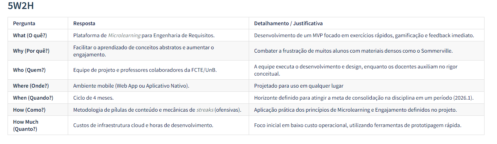

# Sketch

## 1. Introdução

A fase de **Sketch** (Esboço) é a segunda etapa do Design Sprint e tem como objetivo central a geração de soluções para o problema definido na etapa de Mapping. Tradicionalmente, cada participante trabalha de forma independente, propondo ideias e soluções visuais sem a interferência do grupo, o que garante diversidade de perspectivas e evita o viés de consenso prematuro (Knapp; Zeratsky; Kowitz, 2016).

No contexto do projeto **Conhecendo Requisitos**, a fase de Sketch foi adaptada estrategicamente: em vez de esboços de telas, a equipe utilizou essa etapa para a produção de **artefatos generalistas**, documentos analíticos que aprofundam a compreensão do problema e constroem a base conceitual necessária para as fases seguintes do sprint. Cada artefato foi desenvolvido de forma assíncrona, de um a três integrantes responsáveis por cada entrega.

Os artefatos produzidos foram: **Glossário**, **Rich Picture**, **Léxico**, **Diagrama de Ishikawa** e **5W2H**. Juntos, eles cobrem desde a padronização do vocabulário do projeto até a análise de causas-raiz e o planejamento das ações, oferecendo uma visão abrangente do cenário antes da tomada de decisões.

---

## 2. Metodologia

Diferentemente da etapa de [Mapping](https://unbarqdsw2026-1-turma01.github.io/Grupo02_ConhecendoRequisitos_Entrega01/#/Base/1.1.1.Mapping), que foi conduzida em sessões síncronas, a fase de Sketch foi realizada de forma **assíncrona**. Cada integranteficou responsável por um artefato específico, desenvolvendo-o de maneira independente com base nos alinhamentos feitos durante o Mapping. Ao final, os artefatos foram reunidos e revisados coletivamente pela equipe.

---

## 3. Papéis dos Membros

**Tabela 1:** Responsáveis pelos Artefatos da Fase de Sketch

| Artefato | Responsável(is) |
|---|---|
| Glossário | Arthur Evangelista |
| Rich Picture | Yan Aguiar e Carlos Nascimento |
| Léxico | Letícia Maria, Eduarda Rodrigues e Lucas Avelar |
| Diagrama de Ishikawa | Yasmin Nascimento e Isabella Choukaira |
| 5W2H | Daniel Rodrigues e Davi Mesquita |
| Revisão geral | Todos os membros |

*Fonte: elaborado pelos autores (2026).*

---

## 4. Artefatos Produzidos

Os artefatos a seguir representam os resultados da fase de Sketch. Cada um é apresentado com uma breve descrição de seu propósito e um link para sua documentação completa, onde é possível encontrar a metodologia de construção, as justificativas das escolhas e a análise detalhada.

### 4.1 Glossário

O **Glossário** reúne e define os principais termos do domínio do projeto, estabelecendo uma linguagem comum entre todos os integrantes da equipe. Segundo Wiegers e Beatty (2013), a definição clara de vocabulário é um dos pilares da Engenharia de Requisitos de qualidade, pois evita que diferentes partes do sistema sejam concebidas com entendimentos divergentes sobre o mesmo conceito.

No projeto Conhecendo Requisitos, o glossário cobre os termos da plataforma, da Engenharia de Requisitos, da gamificação e do desenvolvimento web, garantindo que toda a equipe compartilhe o mesmo entendimento ao longo do desenvolvimento.

> A documentação completa do Glossário, incluindo todos os termos definidos e a metodologia adotada, está disponível em [Glossário](https://unbarqdsw2026-1-turma01.github.io/Grupo02_ConhecendoRequisitos_Entrega01/#/Base/1.2.2.glossario).

### 4.2 Rich Picture

O **Rich Picture** é uma representação visual informal do sistema e de seu contexto, utilizada para capturar a complexidade de uma situação de forma rápida e colaborativa. Por meio de desenhos, símbolos e anotações livres, o artefato permite que a equipe externalize sua compreensão do problema, identificando atores, processos, conflitos e relações antes mesmo de qualquer especificação formal (Checkland; Scholes, 1990).

No projeto, o Rich Picture foi utilizado para mapear visualmente os elementos centrais da plataforma,consolidando o entendimento coletivo sobre o funcionamento do sistema.

<b> Figura 1:</b> Rich Picture do ConhecendoRequisitos

_Fonte: Integrantes da equipe._

> A documentação completa do Rich Picture está disponível em [Rich Picture](https://unbarqdsw2026-1-turma01.github.io/Grupo02_ConhecendoRequisitos_Entrega01/#/Base/1.2.1.RichPicture).

### 4.3 Léxico

O **Léxico** (ou Léxico Ampliado da Linguagem — LAL) é uma técnica de elicitação de requisitos que descreve os símbolos, termos e expressões do domínio da aplicação por meio de três campos: **noção** (o que é), **impacto** (o que provoca no sistema) e **sinônimos** (outras formas de referência). O objetivo é capturar o vocabulário da aplicação de forma mais rica e contextualizada do que um glossário convencional (Leite et al., 1994).

No projeto ConhecendoRequisitos, o Léxico descreve os termos centrais da plataforma — como trilha, desafio e feedback — sob a perspectiva de seu comportamento e impacto dentro do sistema.

> A documentação completa do Léxico está disponível em [Léxico](https://unbarqdsw2026-1-turma01.github.io/Grupo02_ConhecendoRequisitos_Entrega01/#/Base/1.2.3.Lexico).

### 4.4 Diagrama de Ishikawa

O **Diagrama de Ishikawa** (também conhecido como Diagrama de Causa e Efeito ou Espinha de Peixe) é uma ferramenta de análise que organiza visualmente as causas-raiz de um problema central. Desenvolvido por Kaoru Ishikawa (1968), o diagrama parte do problema principal e mapeia as categorias de causas que contribuem para ele, permitindo uma análise estruturada e colaborativa.

No contexto do projeto, o diagrama foi utilizado para investigar as causas da dificuldade de aprendizado em Engenharia de Requisitos, subsidiando as decisões de design da plataforma.

**Figura 2:** Diagrama de Ishikawa

*Fonte: elaborado pelos autores (2026).*

> A documentação completa do Diagrama de Ishikawa está disponível em [Diagrama de Ishikawa](https://unbarqdsw2026-1-turma01.github.io/Grupo02_ConhecendoRequisitos_Entrega01/#/Base/1.2.4.DiagramadeIshikawa).

### 4.5 5W2H

O **5W2H** é um framework de planejamento e análise que organiza informações em torno de sete perguntas fundamentais: *What* (O quê), *Why* (Por quê), *Where* (Onde), *When* (Quando), *Who* (Quem), *How* (Como) e *How Much* (Quanto custa). A ferramenta é amplamente utilizada em gestão de projetos para garantir clareza e completude na definição de ações (Campos, 1992).

No projeto Conhecendo Requisitos, o 5W2H foi aplicado para estruturar e justificar as principais decisões do produto, conectando cada ação ao seu responsável, prazo e critério de sucesso.

**Figura 3:** Captura de Tela do 5W2H

*Fonte: elaborado pelos autores (2026).*

> A documentação completa do 5W2H está disponível em [5W2H](https://unbarqdsw2026-1-turma01.github.io/Grupo02_ConhecendoRequisitos_Entrega01/#/Base/1.2.5.5W2H).

---

## 5. Conclusão

A fase de Sketch permitiu que a equipe aprofundasse o entendimento do problema sob diferentes perspectivas — conceitual, visual, linguística, analítica e estratégica. Os cinco artefatos produzidos se complementam: o Glossário e o Léxico estabelecem a linguagem do projeto; o Rich Picture consolida sua visão sistêmica; o Diagrama de Ishikawa revela as causas-raiz das dificuldades de aprendizado; e o 5W2H estrutura as ações necessárias para endereçá-las.

Com esse repertório construído, a equipe avançou para a fase de **[Decide](https://unbarqdsw2026-1-turma01.github.io/Grupo02_ConhecendoRequisitos_Entrega01/#/Base/1.1.3.Decide)**, na qual foi decidido utilizar como base para nosso [Storyboard](https://unbarqdsw2026-1-turma01.github.io/Grupo02_ConhecendoRequisitos_Entrega01/#/Base/1.1.3.Decide?id=_24-resultado-storyboard-final-de-8-quadros) o [Diagrama de Ishikawa](https://unbarqdsw2026-1-turma01.github.io/Grupo02_ConhecendoRequisitos_Entrega01/#/Base/1.2.4.DiagramadeIshikawa) e o [RichPicture](https://unbarqdsw2026-1-turma01.github.io/Grupo02_ConhecendoRequisitos_Entrega01/#/Base/1.2.1.RichPicture).

---

## 6. Referências Bibliográficas

> 1. CAMPOS, V. F. **TQC: Controle da Qualidade Total no estilo japonês**. Belo Horizonte: Fundação Christiano Ottoni, 1992.

> 2. CHECKLAND, P.; SCHOLES, J. **Soft Systems Methodology in Action**. Chichester: Wiley, 1990.

> 3. GOOGLE VENTURES. **The Design Sprint**. Disponível em: https://www.gv.com/sprint/. Acesso em: 28 de março de 2026.

> 4. ISHIKAWA, K. **Guide to Quality Control**. Tokyo: Asian Productivity Organization, 1968.

> 5. KNAPP, J.; ZERATSKY, J.; KOWITZ, B. **Sprint: O Método Usado no Google para Testar e Aplicar Novas Ideias em Apenas Cinco Dias**. Rio de Janeiro: Intrínseca, 2016.

> 6. LEITE, J. C. S. P. et al. Enhancing a requirements baseline with scenarios. In: **Proceedings of the 3rd IEEE International Symposium on Requirements Engineering**. Washington: IEEE, 1997.

> 7. WIEGERS, K.; BEATTY, J. **Software Requirements**. 3. ed. Redmond, WA: Microsoft Press, 2013.

---

## Histórico de versões

| Versão | Data       | Descrição                 | Autores                                                                                            | Revisor |
| ------ | ---------- | ------------------------- | -------------------------------------------------------------------------------------------------- | ------- |
| 1.0    | 31/03/2026 | Adicionado o Rich Picture | [Yan Matheus](https://github.com/Yanmatheus0812) e [Carlos Nascimento](https://github.com/CDGodoy) |    [Arthur Evangelista](https://github.com/arthurevg)     |
| 1.1    | 05/04/2026 | Adição de Introdução, Metodologia, os 4 Artefatos Generalistas restantes, Conclusão e Referências Bibliográficas| [Arthur Evangelista](https://github.com/arthurevg) |  [Yan Matheus](https://github.com/Yanmatheus0812)      |
