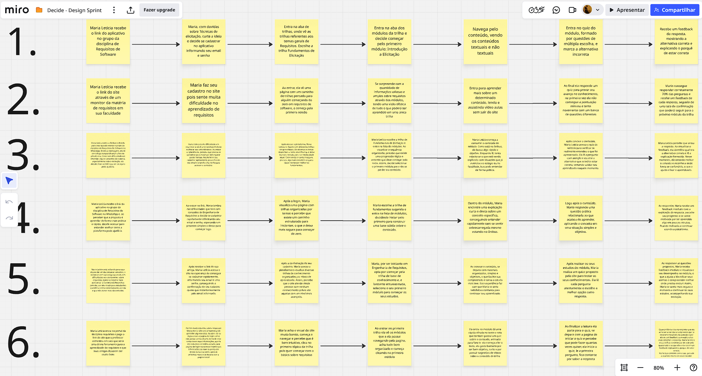
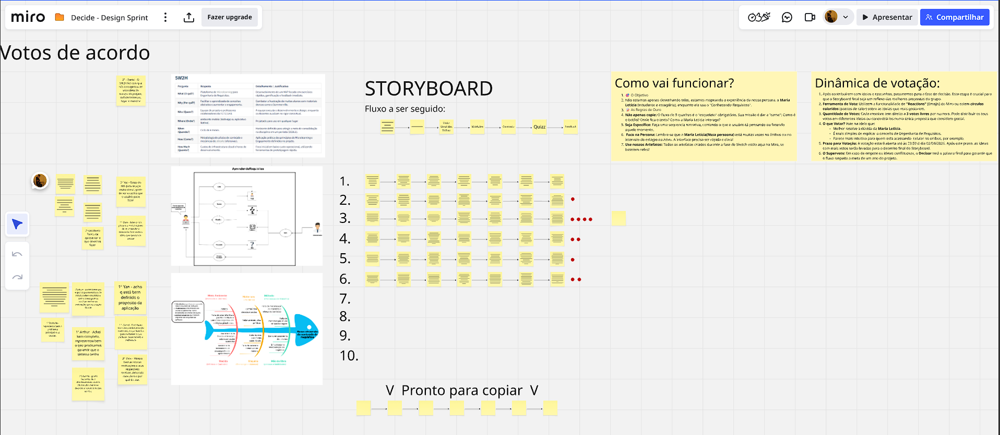
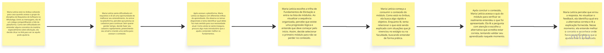

# Decide

## 1. Introdução

A fase **Decide** é o momento de convergência do Design Sprint: após gerar diversas ideias na etapa *Sketch*, o grupo precisa escolher **uma única solução** para prototipar e testar.

O objetivo não é encontrar a ideia perfeita, mas sim a mais promissora, aquela com maior potencial de impacto para o usuário e viável dentro das restrições do projeto. Para isso, o Design Sprint propõe mecanismos estruturados de votação que combinam avaliação individual com síntese coletiva, evitando dois problemas comuns em decisões de grupo: a dominância de uma única voz e a paralisia diante de muitas opções.

Neste projeto, os critérios de decisão adotados foram **impacto pedagógico**, ou seja, o quanto a solução contribui para o aprendizado efetivo de Engenharia de Requisitos e  a **viabilidade técnica**, o quanto pode ser implementada dentro das restrições de tempo e recursos da equipe.

## 2. Metodologia

### 2.1 Votação nos Artefatos de Base

O primeiro passo da fase *Decide* foi definir **quais artefatos produzidos durante o *[Sketch](https://unbarqdsw2026-1-turma01.github.io/Grupo02_ConhecendoRequisitos_Entrega01/#/Base/1.1.2.Sketch)* serviriam de base para as decisões seguintes. Para isso, realizamos uma sessão de **Dot Voting no Miro**: cada membro participante dessa fase, disponível na Tabela 1,  distribuiu pontos entre os artefatos disponíveis, e os dois com maior concentração de votos foram selecionados.

Tabela 1: Participantes da fase Decide

| Matrícula | Aluno              |
| --------- | ------------------ |
| 231027032 | Arthur Evangelista |
| 231037665 | Daniel Nascimento  |
| 222006650 | Davi Sousa         |
| 231026699 | Eduarda Rodrigues  |
| 231037692 | Isabella Choukaira |
| 231035455 | Leticia Jesus      |
| 231038303 | Yan Aguiar         |
| 231012316 | Yasmin Nascimento  |

Os artefatos vencedores foram o **Rich Picture** e o **Diagrama de Ishikawa**. A escolha dos dois juntos não foi acidental, cada um opera em um nível diferente de análise e, por isso, se complementam:

- O **Rich Picture** funcionou como um mapeamento visual das funcionalidades propostas. Ele permitiu identificar os principais componentes da solução e suas fronteiras, demonstrando como a plataforma se posiciona frente aos desafios da persona. Ao ilustrar as interações entre a estudante, o diagrama serviu como uma prova de conceito visual para a estrutura de trilhas. O RichPicture está apresentado na Figura 1. Para mais informações sobre o RichPicture, consulte a seção [1.2.1 Rich Picture](https://unbarqdsw2026-1-turma01.github.io/Grupo02_ConhecendoRequisitos_Entrega01/#/Base/1.2.1.RichPicture)

<b> Figura 1:</b> Rich Picture do ConhecendoRequisitos

_Fonte: Integrantes da equipe._

- O **Diagrama de Ishikawa** aprofundou o diagnóstico ao identificar as **causas-raiz da dificuldade de aprendizado**: falta de exemplos práticos contextualizados, desmotivação pela ausência de progressão visível, ausência de feedback imediato e materiais excessivamente densos para o contexto de uso. Cada uma dessas causas se tornou um critério implícito de avaliação durante as votações seguintes. O Diagrama está apresentado na Figura 2. Para mais informações sobre o Diagrama de Ishikawa, visite a seção [1.2.4 Diagrama de Ishikawa](https://unbarqdsw2026-1-turma01.github.io/Grupo02_ConhecendoRequisitos_Entrega01/#/Base/1.2.4.DiagramadeIshikawa)

<b> Figura 2:</b> Diagrama de Ishikawa aplicado ao problema de aprendizagem em requisitos de software.

*Fonte: Integrantes da equipe (2026).*

---

### 2.2 Construção Individual dos Storyboards

Com os artefatos de base definidos, cada membro produziu individualmente um **storyboard** representando sua proposta de fluxo de interação da persona com a plataforma. A produção individual é uma escolha deliberada do Design Sprint: ao trabalhar de forma independente, cada pessoa traz sua própria leitura dos problemas identificados, o que aumenta a diversidade de soluções e reduz o risco de convergência prematura para a ideia do membro mais vocal do grupo.

Os storyboards foram então registrados no Miro, tornando-se objetos de análise coletiva na etapa seguinte. A figura 3 mostra os Storyboards criados. Para melhor visualização

<b> Figura 3:</b> Storyboards individuais

*Fonte: Elaborado pelos autores (2026).*

---

### 2.3 Votação Final: Dot Voting nos Storyboards

Com todos os storyboards visíveis no Miro, realizamos uma segunda sessão de **Dot Voting**, visível na Figura 4, para selecionar o fluxo vencedor. O protocolo seguiu as mesmas regras da primeira votação:

1. **Análise em silêncio** — cada membro revisou todos os storyboards de forma independente, sem comunicação verbal, preservando a autonomia do julgamento;
2. **Distribuição de pontos** — cada participante alocou seus *dots* nos elementos que considerou mais relevantes, guiado pelos critérios de impacto pedagógico e viabilidade técnica;
3. **Leitura do resultado** — a concentração visual de pontos indicou os elementos com maior suporte coletivo;
4. **Síntese** — os elementos mais votados foram integrados em um storyboard unificado, representando a decisão final do grupo.

<b> Figura 4:</b> Resultado da votação

*Fonte: Elaborado pelos autores (2026).*

Para uma melhor visualização do que foi criado, abaixo está disponível a visualização do quadro Miro utilizado pela equipe:

<iframe
  width="100%"
  height="600"
  src="https://miro.com/app/live-embed/uXjVGoa3Oq8=/"
  frameBorder="0"
  scrolling="no"
  allow="fullscreen; clipboard-read; clipboard-write"
  allowFullScreen>
</iframe>

---

### 2.4 Resultado: Storyboard Final de 8 Quadros

O storyboard consolidado está representado na Figura 5 e define o fluxo completo de interação da persona com a plataforma, da descoberta até a conclusão de um módulo. Cada quadro foi mantido ou adaptado com base nos votos recebidos e na rastreabilidade com os problemas identificados nos artefatos de base.

<b> Figura 5:</b> Storyboard escolhido

*Fonte: Elaborado pelos autores (2026).*

---

<strong>Quadro 1: Descoberta</strong>

"Maria Letícia está no ônibus voltando para casa quando acessa o grupo da disciplina de Requisitos de Software no WhatsApp. Entre as mensagens, ela vê um colega compartilhando o link da plataforma. Como tem dificuldade em entender alguns conceitos da matéria, especialmente sobre elicitação, ela decide clicar no link para ver se aquilo pode ajudá-la.". Este quadro representa o primeiro contato com a existência da ferramenta e foi incluído para endereçar a causa identificada no [Ishikawa](https://unbarqdsw2026-1-turma01.github.io/Grupo02_ConhecendoRequisitos_Entrega01/#/Base/1.2.4.DiagramadeIshikawa) de *Falta de uma plataforma centralizada de requisitos*.

 

<strong>Quadro 2: Login / Cadastro</strong>

"Maria Letícia sente dificuldade em requisitos e vê ali uma oportunidade de melhorar seu entendimento. Ao entrar na plataforma, percebe que precisa se cadastrar para continuar. Sem querer perder tempo, decide fazer seu cadastro rapidamente, preenchendo seu email e criando uma senha para acessar o conteúdo."

 

<strong>Quadro 3: Visão Geral das Trilhas</strong>

"Após acessar a plataforma, Maria Letícia se depara com diferentes trilhas de aprendizado. Ela observa os temas disponíveis e tenta identificar qual deles faz mais sentido para sua necessidade atual. Como ainda se sente insegura, procura algo mais introdutório que a ajude a entender melhor os fundamentos.". Este quadro representa outro problema abordado no [Diagrama de Ishikawa](https://unbarqdsw2026-1-turma01.github.io/Grupo02_ConhecendoRequisitos_Entrega01/#/Base/1.2.4.DiagramadeIshikawa), *Conteúdos dispersos em múltiplas plataformas*.

 

<strong>Quadro 4: Módulos</strong>

"Maria Letícia escolhe a trilha de Fundamentos de Elicitação e entra na lista de módulos. Ao visualizar a sequência organizada, percebe que existe uma progressão lógica e entende que deve começar pelo início. Assim, decide selecionar o primeiro módulo para não se perder no conteúdo."

 

<strong>Quadro 5: Conteúdo</strong>

"Maria Letícia começa a consumir o conteúdo do módulo. Como está no ônibus, ela busca algo rápido e objetivo. Enquanto lê, tenta relacionar o que está sendo explicado com situações que já vivenciou no estágio ou na faculdade, buscando entender de forma prática.". Este quadro responde diretamente à causa *"falta de exemplos práticos"* identificada no [Diagrama de Ishikawa](https://unbarqdsw2026-1-turma01.github.io/Grupo02_ConhecendoRequisitos_Entrega01/#/Base/1.2.4.DiagramadeIshikawa).

 

<strong>Quadro 6: Quiz</strong>

"Após concluir o conteúdo, Maria Letícia acessa o quiz do módulo para verificar se realmente entendeu o que foi apresentado. Ela lê a pergunta com atenção e escolhe a alternativa que acredita estar correta, tentando validar seu aprendizado naquele momento.". Este quadro responde diretamente às causas *"Falta de recursos interativos"* e *"Falta de metodologia ativa na aprendizagem"* também do [Diagrama de Ishikawa](https://unbarqdsw2026-1-turma01.github.io/Grupo02_ConhecendoRequisitos_Entrega01/#/Base/1.2.4.DiagramadeIshikawa).

 

<strong>Quadro 7: Feedback Educativo</strong>

"Maria Letícia percebe que errou a resposta. Ao visualizar o feedback, ela identifica qual era a alternativa correta e lê a explicação fornecida. Nesse momento, ela entende melhor o conceito e reconhece onde havia se confundido, o que a ajuda a fixar o aprendizado.". Este quadro atende diretamente às causas *"Inexistência de feedback imediato sobre atividades realizadas"* e *"Falta de mecanismos de repetição e reforço do conteúdo"* levantadas no [Diagrama de Ishikawa](https://unbarqdsw2026-1-turma01.github.io/Grupo02_ConhecendoRequisitos_Entrega01/#/Base/1.2.4.DiagramadeIshikawa).

## 3. Conclusão
A fase Decide do Design Sprint do projeto Conhecendo Requisitos resultou em um Storyboard de 7 quadros que sintetiza, de forma coerente e rastreável, as necessidades identificadas nas etapas anteriores. O processo de decisão,fundamentado em artefatos de análise sistêmica ([Rich Picture](https://unbarqdsw2026-1-turma01.github.io/Grupo02_ConhecendoRequisitos_Entrega01/#/Base/1.2.1.RichPicture)) e causal ([Diagrama de Ishikawa](https://unbarqdsw2026-1-turma01.github.io/Grupo02_ConhecendoRequisitos_Entrega01/#/Base/1.2.4.DiagramadeIshikawa).) e estruturado por uma metodologia de votação participativa e isenta de pressão social (Dot Voting), garantiu que a solução selecionada reflete tanto o contexto real da persona quanto os objetivos pedagógicos da plataforma.

O resultado desta fase fornece a base necessária para a construção do [protótipo de alta fidelidade](https://unbarqdsw2026-1-turma01.github.io/Grupo02_ConhecendoRequisitos_Entrega01/#/Base/1.1.4.Prototipo) na etapa subsequente, orientando as decisões de interface, interação e arquitetura de informação com fundamento explícito nos problemas identificados e nas evidências coletadas.

## 3. Referências Bibliográficas

> 1. GOOGLE VENTURES. **The Design Sprint**. Disponível em: [https://designsprintkit.withgoogle.com](https://designsprintkit.withgoogle.com). Acesso em: 04/04/2026.

> 2. KNAPP, J.; ZERATSKY, J.; KOWITZ, B. **Sprint: How to solve big problems and test new ideas in just five days**. New York: Simon & Schuster, 2016. Disponível em: [https://www.thesprintbook.com](https://www.thesprintbook.com)

> 3. NIELSEN NORMAN GROUP. **Storyboards in UX Design**. Disponível em: [https://www.nngroup.com/articles/storyboards-visualize-ideas](https://www.nngroup.com/articles/storyboards-visualize-ideas). Acesso em: 04/04/2025.

## Histórico de versões

| Versão | Data       | Descrição             | Autor                                            | Revisor |
| ------ | ---------- | --------------------- | ------------------------------------------------ | ------- |
| 1.0    | 04/04/2026 | Criação do documento e adição dos artefatos produzidos durante a etapa de Decide | [Arthur Evangelista](https://github.com/arthurevg) | [Lucas Avelar](https://github.com/LucasAvelar2711)  |