# Prototype

## Introdução

O protótipo é uma representação inicial de um design, criada para testar e validar ideias antes do desenvolvimento final. Ele permite que os usuários interajam com o sistema e avaliem sua usabilidade e aparência, identificando possíveis falhas e melhorias. O protótipo pode variar de esboços simples a versões digitais de alta fidelidade, permitindo simular soluções antes da implementação. Essa prática reduz custos e retrabalho, além de garantir que o design e as funcionalidades atendam às necessidades reais dos usuários[[1]](#bibliografia).

## Objetivos

Verificar a usabilidade, a compreensibilidade e a adequação das telas desenvolvidas para o site ConhecendoRequisitos, identificando problemas de interação e oportunidades de melhoria antes de avançar para a implementação final.

## Participantes

Tabela 1: Participantes da elaboração do protótipo

| Matrícula | Aluno              |
| --------- | ------------------ |
| 231027032 | Arthur Oliveira    |
| 231037692 | Isabella Choukaira |
| 231035455 | Leticia Jesus      |
| 231038303 | Yan Aguiar         |
| 231012316 | Yasmin Nascimento  |

## Protótipo de alta fidelidade

<iframe style="border: 1px solid rgba(0, 0, 0, 0.1);" width="800" height="450" src="https://embed.figma.com/design/2fL2A75XSM7oaHx2yJXJ8K/ConhecendoRequisitos?node-id=0-1&embed-host=share" allowfullscreen></iframe>

Acompanhe com mais detalhes cada tela prodizida abaixo:

### Login / Cadastro

O usuário deve criar uma conta para acessar o site, para armazenar seu progresso de aprendizado.

<b> Figura 1:</b> Login

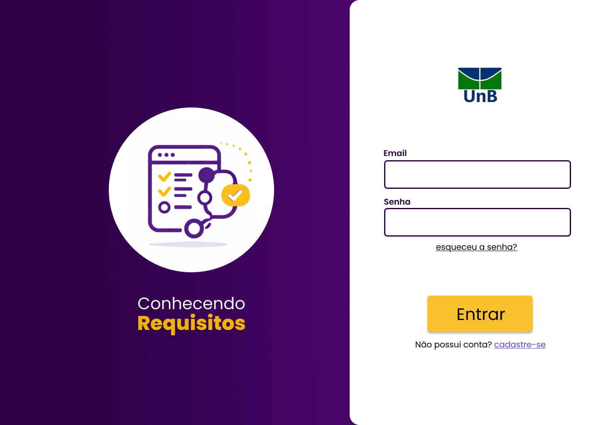

_Fonte: elaborado pelos autores (2026)._

<b> Figura 2:</b> Cadastro

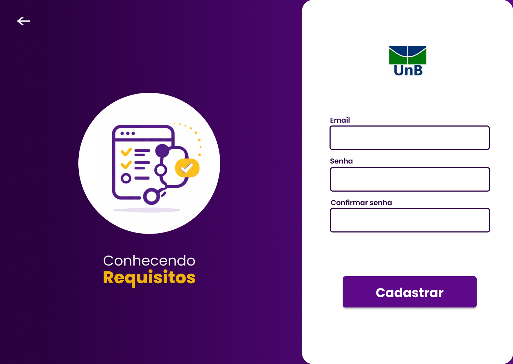

_Fonte: elaborado pelos autores (2026)._

<b> Figura 3:</b> Esqueceu a senha

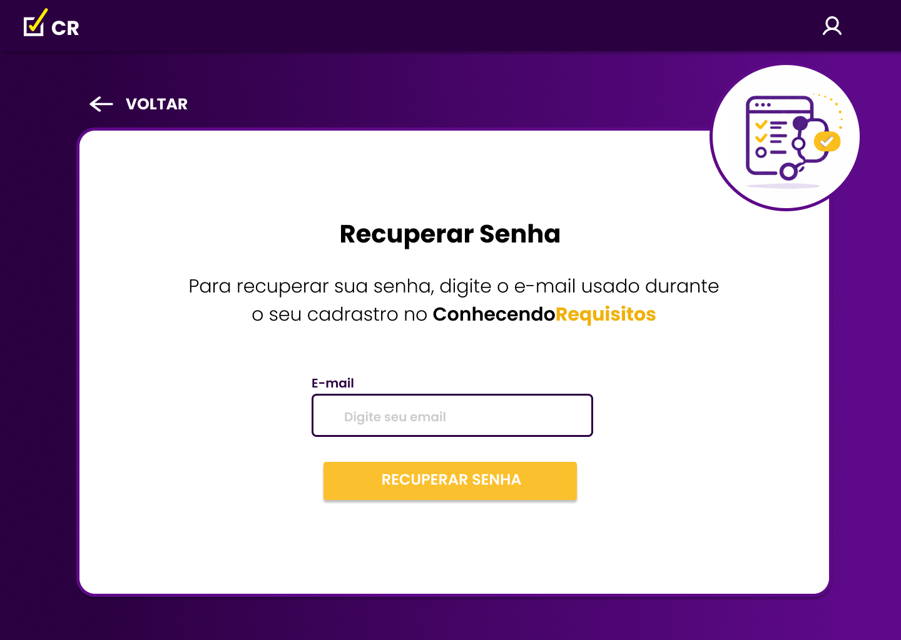

_Fonte: elaborado pelos autores (2026)._

### Página inicial / Trilhas

O usuário poderá acessar suas trilhas de conteúdos, sabendo quais finalizou, quais estão em andamento ou finalizadas. As trilhas formam um caminho lógico no aprendizado de requisitos de software.

<b> Figura 4:</b> Trilhas disponíveis

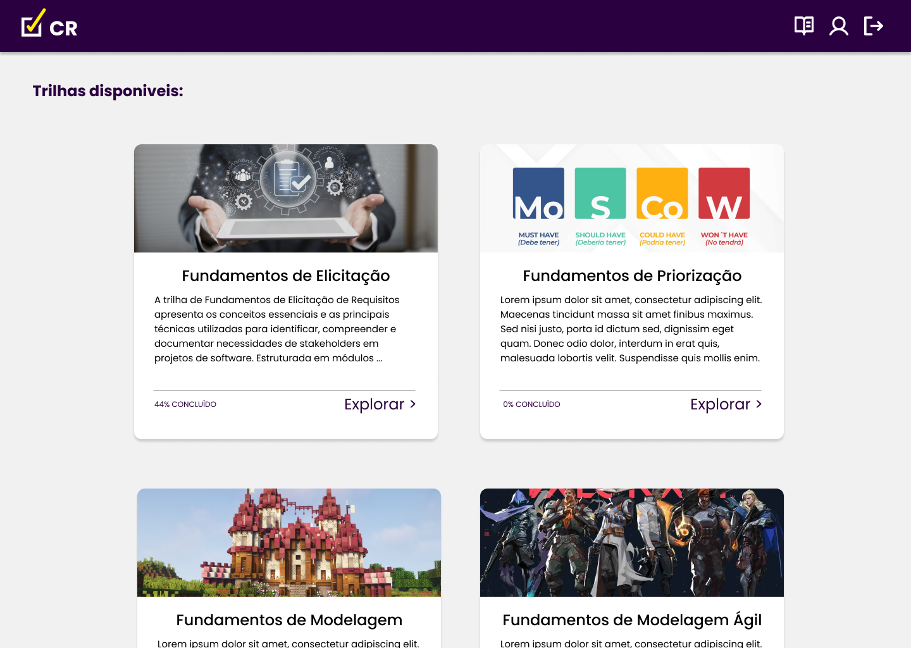

_Fonte: elaborado pelos autores (2026)._

### Explorar a trilha

O usuário poderá entrar em cada trilha e explorar seus módulos, sendo sub-etapas obrigatórias (módulos) para o aprendizado de algo mais amplo (trilhas)

<b> Figura 5:</b> Módulo da trilha

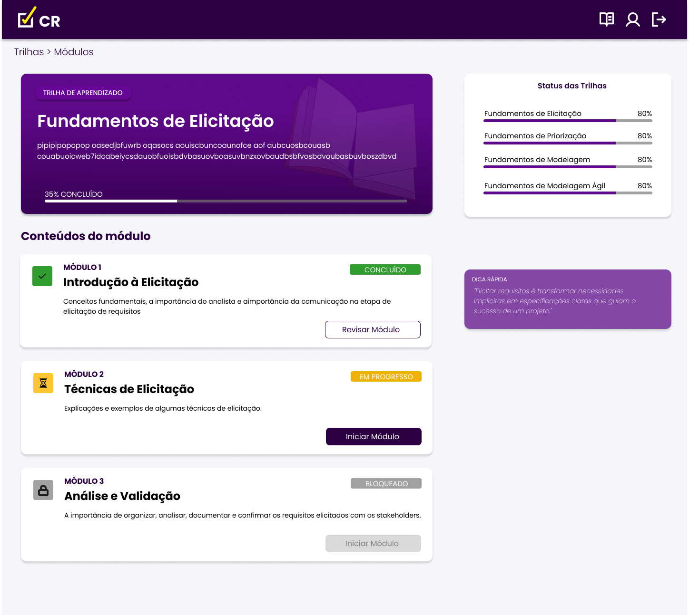

_Fonte: elaborado pelos autores (2026)._

### Conteúdo

O usuário poderá acessar o conteúdo do módulo, onde terá acesso à video-aulas ou explicações em texto sobre algum conteúdo expecífico.

<b> Figura 6:</b> Conteúdo

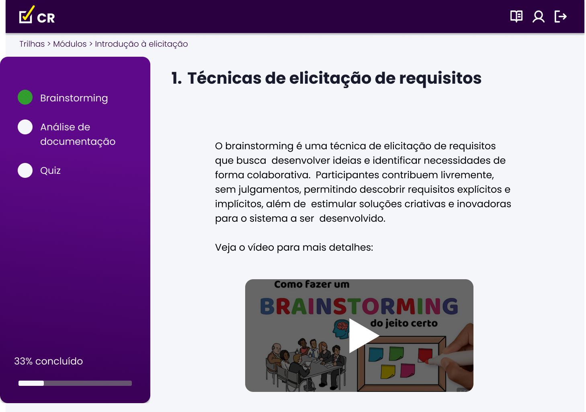

_Fonte: elaborado pelos autores (2026)._

### Quiz

Ao final do conteúdo, o usuário deve responder ao um quiz para comprovar seu avanço de aprendizado no módulo, tendo feedbacks constantes de respostas certas e erradas, caso consiga mais de 70% de acertos, o usuário desbloqueia o acesso ao próximo módulo da trilha.

<b> Figura 7:</b> Quiz

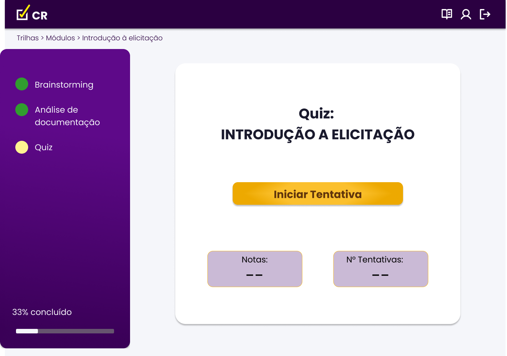

_Fonte: elaborado pelos autores (2026)._

<b> Figura 8:</b> Quiz questao 1

_Fonte: elaborado pelos autores (2026)._

<b> Figura 9:</b> Quiz acertou

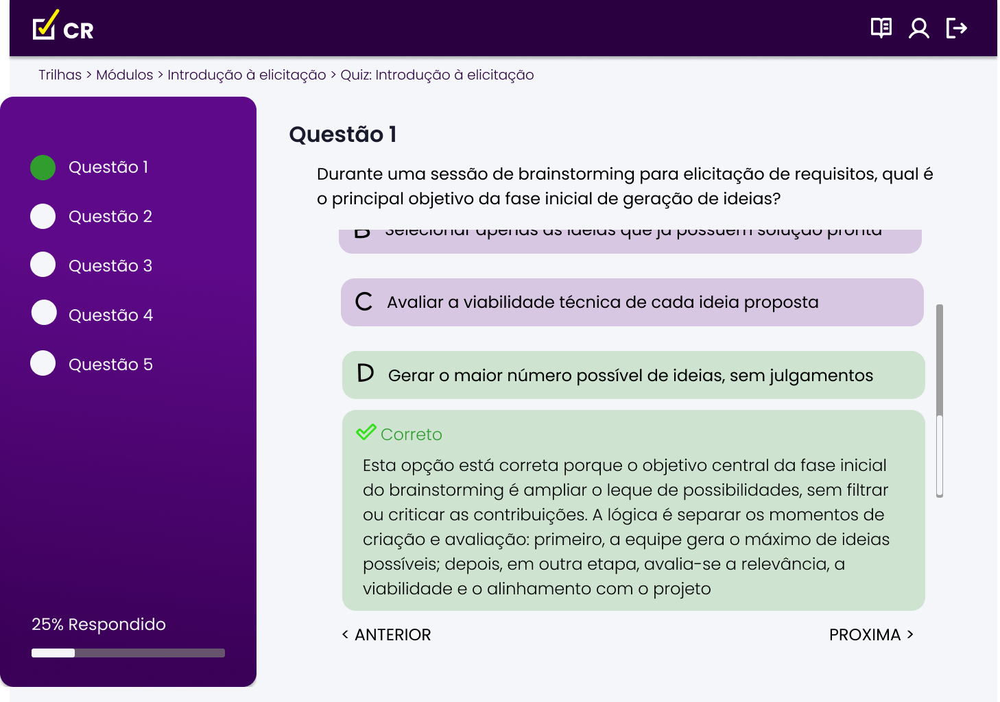

_Fonte: elaborado pelos autores (2026)._

<b> Figura 10:</b> Quiz questão 5

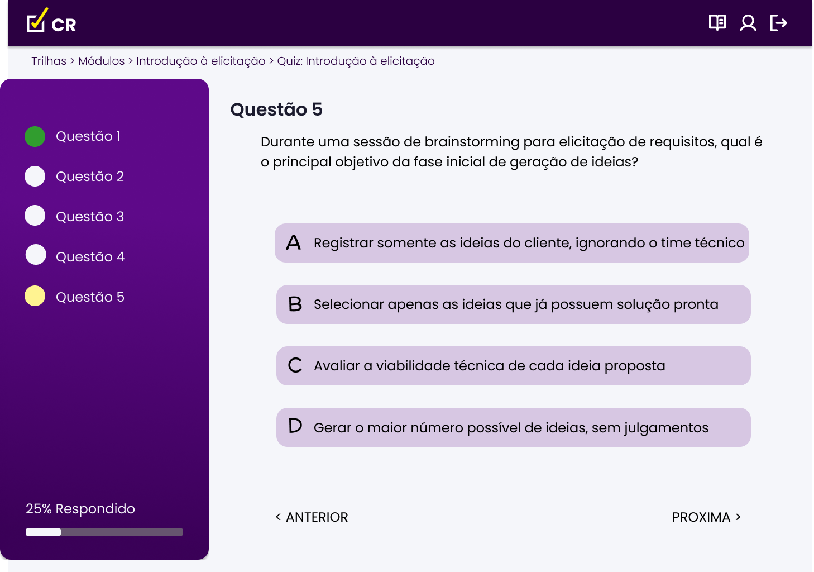

_Fonte: elaborado pelos autores (2026)._

<b> Figura 11:</b> Quiz errou

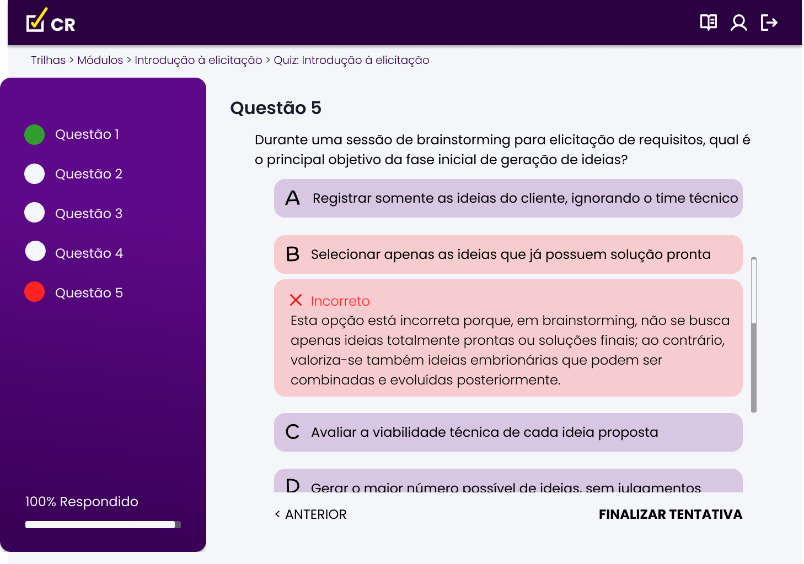

_Fonte: elaborado pelos autores (2026)._

<b> Figura 12:</b> Quiz continuar

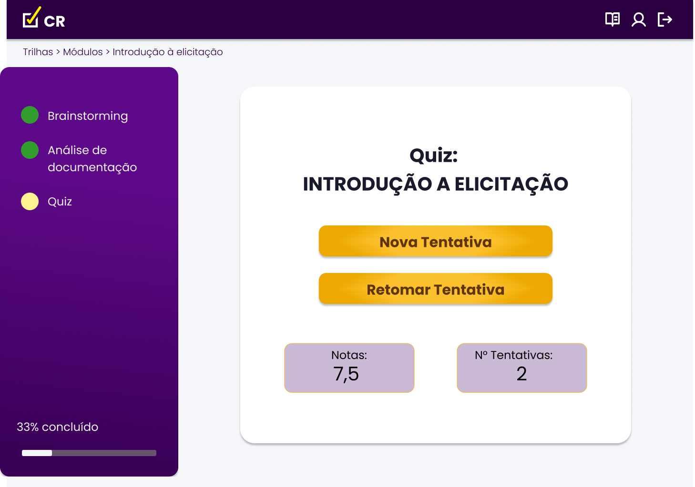

_Fonte: elaborado pelos autores (2026)._

## Bibliografia

1. ROGERS, Yvonne; SHARP, Helen; PREECE, Jennifer. Design de Interação: Além da Interação Humano-Computador. 3. ed. Porto Alegre: Bookman, 2013. xiv, 585 p.Cap 8 Acesso em: 11 nov. 2025

## Histórico de versões

| Versão | Data       | Descrição            | Autores                                          | Revisor |
| ------ | ---------- | -------------------- | ------------------------------------------------ | ------- |
| 1.0    | 02/04/2026 | Criação do documento | [Yan Matheus](https://github.com/Yanmatheus0812) |         |
