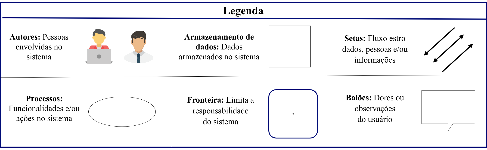

# Rich Picture

As Rich Pictures são representações visuais que ilustram os principais elementos de uma situação e seus relacionamentos. Elas podem ser utilizadas tanto para apoiar a compreensão de um contexto quanto para identificar pontos de melhoria. Na prática, consistem em uma combinação de imagens, textos, símbolos e ícones organizados de forma integrada[[1]](#bibliografia).

## Participantes

Os participantes da elaboração do Rich Picture estão descritos na tabela a seguir:

Tabela 1: Participantes da elaboração do Rich Picture

| Matrícula | Aluno             |
| --------- | ----------------- |
| 190042303 | Carlos Nascimento |
| 231038303 | Yan Aguiar        |

## Metodologia e ferramentas

  <strong>Figura 1:</strong> Rich Picture do ConhecendoRequisitos 
   
  <em>Fonte: Integrantes da equipe</em>

  <strong>Figura 2:</strong> Legenda do rich Picture do ConhecendoRequisitos 
   
  <em>Fonte: Integrantes da equipe</em>

## Bibliografia

1. David Benyon. Interação Humano-Computador. São Paulo, v2.0, Pearson Prentice Hall, 2011. "Software requirements", Breakdown topics for software requirements, Capítulo Software Development Project, Introducing Rich Pictures

## Histórico de versões

| Versão | Data       | Descrição                     | Autores                                                                  | Revisor |
| ------ | ---------- | ----------------------------- | ------------------------------------------------------------------------ | ------- |
| 1.0    | 31/03/2026 | Implementação do Rich Picture | [Yan Matheus](https://github.com/Yanmatheus0812) e [Carlos Nascimento]() |         |
