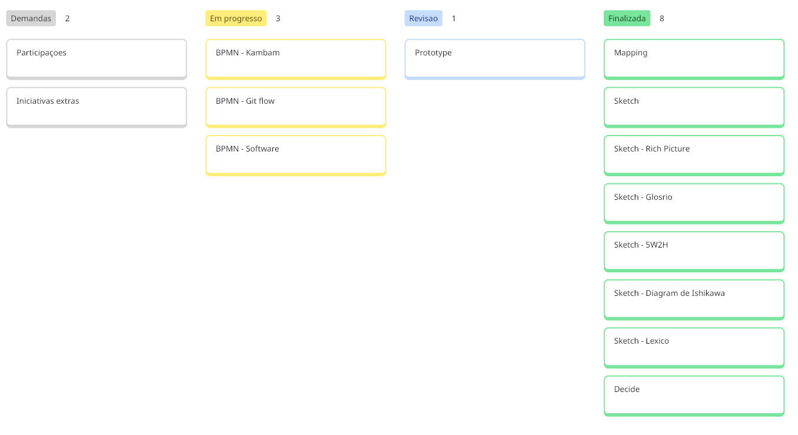
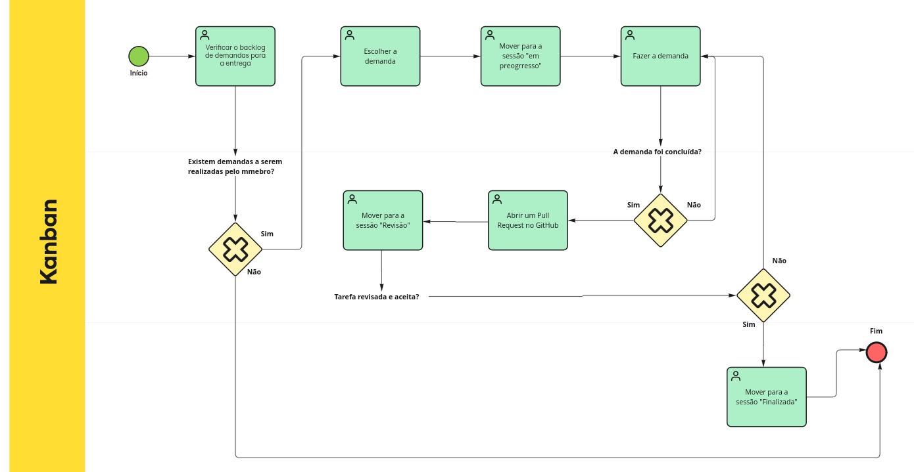

# BPMN Kanban

Neste projeto, utilizaremos o Kanban no software [Miro](https://miro.com/pt/) para organizar e acompanhar o fluxo de trabalho. O processo segue o modelo representado no BPMN, garantindo clareza e padronização no acompanhamento das tarefas. A descrição detalhada dos responsáveis por cada demanda, optamos por nos organizar pelo [Cronograma](/Base/1.5.1.Cronograma.md), onde mostra além disso informações sobre o início, termino previsto e realizado de cada atividade.

<b> Figura 1:</b> Kanbam do grupo

_Fonte: elaborado pelos autores (2026)._

## Participantes

Tabela 1: Participantes da elaboração do BPMN Kanbam

| Matrícula | Aluno              |
| --------- | ------------------ |
| 231037692 | Isabella Choukaira |
| 231038303 | Yan Aguiar         |
| 231012316 | Yasmin Nascimento  |

## BPMN

Abaixo, segue o BPMN do fluxo do Kanbam da equipe com o link para o Miro ou abaixo, a imagem.

<iframe width="768" height="432" src="https://miro.com/app/live-embed/uXjVGn9Mhd8=/?embedMode=view_only_without_ui&moveToViewport=-381,-265,2848,1412&embedId=98817486157" frameborder="0" scrolling="no" allow="fullscreen; clipboard-read; clipboard-write" allowfullscreen></iframe>

<b> Figura 2:</b> BPMN Kanbam

_Fonte: elaborado pelos autores (2026)._

## Passos do fluxo

1. **Início** – O processo é iniciado com a verificação do backlog de demandas disponíveis.

2. **Verificar o backlog de demandas para entrega** – Analisa-se se existem demandas disponíveis para execução.

3. **Existe demanda a ser realizada pelo membro?**
   - Se **não**, o processo é encerrado.
   - Se **sim**, segue para a escolha da demanda.

4. **Escolher a demanda** – O membro seleciona uma demanda a ser desenvolvida.

5. **Mover para a sessão “Em progresso”** – A demanda selecionada é movida para a etapa de execução.

6. **Fazer a demanda** – O membro realiza o desenvolvimento da tarefa.

7. **A demanda foi concluída?**
   - Se **não**, a tarefa permanece em desenvolvimento até sua conclusão.
   - Se **sim**, segue para abertura do Pull Request.

8. **Abrir um Pull Request no GitHub** – A demanda concluída é submetida para revisão.

9. **Mover para a sessão “Revisão”** – A tarefa entra na fase de avaliação.

10. **Tarefa revisada e aceita?**

- Se **não**, a tarefa retorna para ajustes (voltando à etapa de desenvolvimento).
- Se **sim**, segue para finalização.

11. **Mover para a sessão “Finalizado”** – A tarefa é oficialmente concluída.

12. **Fim** – O processo é encerrado após a aprovação da tarefa.

## Referências Bibliográficas

> SERRANO, Milene. Arquitetura e Desenho de Software - DSW-BPMN Disponível em: [vídeo-DSW-BPMN](https://unbbr-my.sharepoint.com/personal/mileneserrano_unb_br/_layouts/15/stream.aspx?id=%2Fpersonal%2Fmileneserrano%5Funb%5Fbr%2FDocuments%2FArqDSW%20%2D%20V%C3%ADdeosOriginais%2F04%20%2D%20VideoAula%20%2D%20DSW%2DBPMN%2Emp4&ga=1&referrer=StreamWebApp%2EWeb&referrerScenario=AddressBarCopied%2Eview%2Ecf16cd28%2D43a2%2D479f%2D8f43%2D6408184eb577&isDarkMode=true) Acesso em: 03 abr. 2026.

## Histórico de versões

| Versão | Data       | Descrição              | Autor                                                                                                                                                                   | Revisor |
| ------ | ---------- | ---------------------- | ----------------------------------------------------------------------------------------------------------------------------------------------------------------------- | ------- |
| 1.0    | 03/04/2026 | Criação do BPMN Kanban | [Yasmin Nascimento](https://github.com/Yasm1nNasc1mento), [Isabella Choukaira](https://github.com/isabellachoukaira) e [Yan Matheus](https://github.com/Yanmatheus0812) |    [Arthur Evangelista](https://github.com/arthurevg)     |
