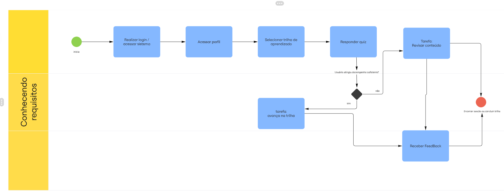

# BPMN do Software

## 1- Introdução 

A conversão de requisitos descritos em linguagem natural para modelos formais representa um dos desafios mais relevantes na engenharia de software. Nesse contexto, a Business Process Model and Notation (BPMN) é utilizada como uma forma intermediária de representação, auxiliando na compreensão dos processos antes da mensuração do tamanho funcional do sistema.

Entretanto, abordagens tradicionais apresentam limitações, principalmente na interpretação de sentenças mais complexas, como frases compostas e compostas-complexas, o que dificulta a geração de diagramas BPMN completos e consistentes.

Diante disso, este trabalho adota uma abordagem baseada em duas etapas principais: inicialmente, realiza-se a análise dos requisitos textuais por meio de técnicas de processamento de linguagem natural, com o objetivo de identificar elementos estruturais relevantes, como os tipos de fatos. Em seguida, esses elementos são utilizados como base para a construção do diagrama BPMN, a partir de regras de mapeamento definidas.

A aplicação desse método em diferentes requisitos demonstrou resultados mais precisos na geração de diagramas BPMN, especialmente quando comparado a abordagens convencionais, evidenciando sua eficácia na modelagem de processos a partir de descrições em linguagem natural.

## 2 -  Metodologia 
A metodologia para geração de diagramas BPMN a partir de requisitos textuais é dividida em duas fases principais:

### Fase 1: Análise dos Requisitos Textuais com PLN

1. **Pré-processamento**: divisão do texto em sentenças e tokenização.
2. **Análise sintática**: POS tagging e parsing de dependência (biblioteca Stanza).
3. **Análise semântica**: rotulagem de papéis semânticos (SRL) baseada em SBVR.
4. **Extração de tipos de fatos**: identificação de fact types unários, binários ou ternários usando regras predefinidas para sentenças simples, compostas, complexas e compostas-complexas.

### Fase 2: Geração do Diagrama BPMN

1. **Mapeamento**: fact types são convertidos em elementos BPMN (atividades, eventos, gateways, datastores, pools/lanes).
2. **Planilha intermediária**: os elementos são organizados em uma tabela com ordem, responsável, condições e fluxos.
3. **Geração do BPMN**: a planilha é convertida automaticamente no diagrama BPMN final.

<b> Figura 2:</b> BPMN Software

_Fonte: [Eduarda Rodrigues](https://github.com/eduardar0) (2026)._

## Passos do fluxo

1. **Evento de Início** – O processo é iniciado quando o usuário acessa a plataforma ConhecendoRequisitos.

2. **Tarefa: Realizar login/acesso ao sistema** – O usuário entra na plataforma com suas credenciais.

3. **Tarefa: Acessar perfil (opcional)** – O usuário pode visualizar ou editar suas informações pessoais.

4. **Tarefa: Selecionar trilha de aprendizado** – O usuário escolhe uma trilha disponível na plataforma.

5. **Tarefa: Visualizar conteúdo** – O usuário acessa o material de estudo relacionado à trilha.

6. **Tarefa: Responder quiz** – O usuário realiza a avaliação com base no conteúdo estudado.

7. **Gateway: Usuário atingiu desempenho suficiente no quiz?**
   - Se **não**, o usuário retorna para revisar o conteúdo e refazer o quiz.
   - Se **sim**, segue para progressão na trilha.

8. **Tarefa: Avançar na trilha** – O usuário progride para os próximos conteúdos da trilha.

9. **Tarefa: Receber feedback** – O sistema apresenta o resultado do desempenho do usuário.

10. **Gateway: Existem mais conteúdos na trilha?**
   - Se **sim**, o usuário retorna para a etapa de visualização de conteúdo.
   - Se **não**, segue para finalização.

11. **Evento de Fim** – O processo é encerrado quando o usuário conclui a trilha de aprendizado.

## Bibliografia

>  SHOLIQ, Sholiq; SARNO, Riyanarto; ASTUTI, Endang Siti. Generating BPMN diagram from textual requirements. 2022. Disponível em: <https://www-sciencedirect-com.ez54.periodicos.capes.gov.br/science/article/pii/S1319157822003585?via%3Dihub>. Acesso em: 04 abr. 2026.

## Histórico de versões

| Versão | Data       | Descrição              | Autor                                                                                                                                                                   | Revisor |
| ------ | ---------- | ---------------------- | ----------------------------------------------------------------------------------------------------------------------------------------------------------------------- | ------- |
| 1.0    | 03/04/2026 | Criação do BPMN do software | [Eduarda Rodrigues](https://github.com/eduardar0) |         |