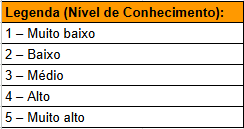
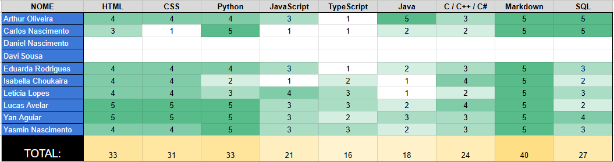
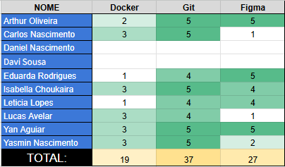
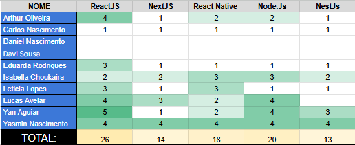

# Conhecimentos da Equipe

## Introdução

Com o objetivo de identificar e organizar as competências técnicas dos integrantes da equipe, foi elaborada uma planilha para o mapeamento dos níveis de conhecimento em diferentes tecnologias relevantes ao projeto. Esse levantamento permite analisar a distribuição de habilidades no grupo e subsidiar a alocação eficiente de tarefas.

A visualização dos dados foi realizada por meio de um **heatmap**, técnica que utiliza variações de cor para representar a magnitude de valores em uma matriz, facilitando a identificação de padrões. [[1]](#bibliografia)

Para o preenchimento e criação do heatmap foi usada a ferramenta [Google Sheets](https://docs.google.com/spreadsheets/u/0/)

## Participantes

Todos os participantes que responderam a planilha estão descritos na tabela a seguir:

Tabela 1: Participantes do Mapeamento de Conhecimentos 

| Matrícula | Aluno              |
| --------- | ------------------ |
| 231027032 | Arthur Oliveira    |
| 190042303 | Carlos Nascimento  |
| 231026699 | Eduarda Rodrigues  |
| 231037692 | Isabella Choukaira |
| 231035455 | Leticia Jesus      |
| 200067095 | Lucas Avelar       |
| 231038303 | Yan Aguiar         |
| 231012316 | Yasmin Nascimento  |

## Metodologia

A planilha foi estruturada em três abas, organizadas por categoria:

- **Linguagens**
  - HTML
  - CSS
  - Python
  - JavaScript
  - TypeScript
  - Java
  - C/C++/C#
  - Markdown
  - SQL

- **Ferramentas**
  - Docker
  - Git
  - Figma

- **Frameworks**
  - ReactJS
  - NextJS
  - React Native
  - Node.js
  - NestJS

Cada integrante atribuiu valores de **1 a 5** para cada tecnologia, representando seu nível de conhecimento. Os dados foram agregados por coluna, permitindo análise quantitativa e visualização por meio de heatmap.

> Quanto mais escura a célula, maior o nível de conhecimento representado no heatmap.

## Legenda

A representação visual adota uma escala monocromática em tons de verde, associada aos valores numéricos:

## Heatmaps

### Linguagens

- **Análise dos Resultados** 

Maiores níveis de domínio:

- Markdown (40)
- HTML (33)
- Python (33)
- CSS (31)

Menores níveis de domínio:

- TypeScript (16)
- Java (18)

>Os dados indicam predominância de conhecimentos voltados ao desenvolvimento web e documentação.

### Ferramentas

- **Análise dos Resultados** 

Totais obtidos:

- Git (37)
- Figma (27)
- Docker (19)

>Observa-se forte domínio em controle de versão, domínio intermediário em prototipação e menor experiência com conteinerização.

### Frameworks

- **Análise dos Resultados** 

Totais obtidos:

- ReactJS (26)
- Node.js (20)
- React Native (18)

Menores níveis:

- NextJS (14)
- NestJS (13)

>Os dados indicam maior familiaridade com tecnologias centrais do JavaScript.

## Conclusão

O mapeamento evidenciou:

- Forte domínio em tecnologias base (HTML, CSS, Python, Markdown)
- Consolidação no uso de Git
- Conhecimento intermediário em frameworks
- Menos conhecimento em TypeScript, Docker, NestJS e NextJS.

Esses resultados podem subsidiar:

- Distribuição eficiente de tarefas
- Planejamento de capacitação
- Redução de riscos no desenvolvimento

A utilização do heatmap mostrou-se adequada para a síntese visual dos dados, permitindo análise rápida e objetiva das competências da equipe.

## Bibliografia

1. PATEL, Neil. Heatmap: o que é e como usar para entender comportamento do usuário. neilpatel.com, 2023. Disponível em: [https://neilpatel.com/br/blog/heatmap-o-que-e/](https://neilpatel.com/br/blog/heatmap-o-que-e/)
   . Acesso em: 28 mar. 2026.

| Versão | Data       | Descrição                                      | Autor                                            | Revisor |
| ------ | ---------- | ---------------------------------------------- | ------------------------------------------------ | ------- |
| 1.0    | 05/04/2026 | Criação da página de conhecimento da equipe |[Letícia Lopes](https://github.com/leticialopes20)   |   [Yasmin Nascimento](https://github.com/Yasm1nNasc1mento)       |
