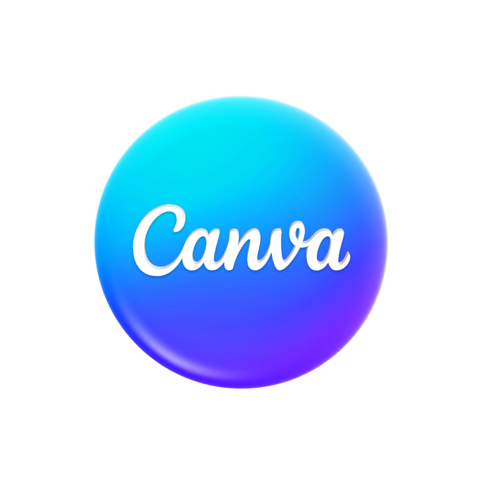
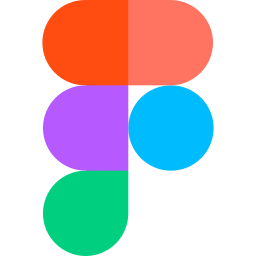
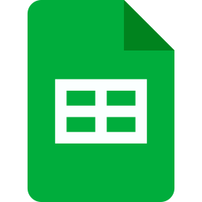

# Ferramentas

## 1. Introdução

Com o objetivo de assegurar maior organização, eficiência na comunicação e qualidade na produção de artefatos durante o desenvolvimento do projeto, foi elaborado um levantamento das principais ferramentas a serem utilizadas pela equipe. A Tabela 1 apresenta essas ferramentas, juntamente com suas finalidades e aplicações previstas ao longo da execução do projeto.

<b>Tabela 1</b> - Ferramentas Utilizadas no Projeto

|                                      Logo                                      |      Ferramenta       |                                                             Finalidade                                                             |
| :----------------------------------------------------------------------------: | :-------------------: | :--------------------------------------------------------------------------------------------------------------------------------: |
|                          |         BPMN.io         |                          Criação de diagramas BPMN.                      |
|                          |         Canva         |                          Criação de slides para as apresentações.                      |
|                           |        ChatGPT        |                             Ferramenta de consulta de dúvidas.                         |
|                             |        Docsify       |                             Criação das páginas de documentação.                             |
|                               |         Figma         |                                   Produção de arte gráfica.                                |
|                             |        GitHub         |       Organização, versionamento e documentação de artefatos produzidos para o projeto.     |
|                         |      Google Docs      |   Ferramenta para a primeira versão da escrita dos documentos necessários para o projeto.  |
|                  |   Google Planilhas    |                 Criação de planilhas relacionadas ao cronograma e horários.                |
|                                 |         Miro          |                     Criação de diagramas, fluxogramas e esquemas visuais.                    |
|                               |         Teams         |                          Realização e gravação de reuniões.                        |
|                             |  Visual Studio Code   |                        Criação e edição dos arquivos de documentação.                       |
|                         |       WhatsApp        |                           Comunicação do time e avisos de demandas.                       |
|                           |        YouTube        |                               Hospedagem de vídeos produzidos.                               |

Fonte: <a href="https://github.com/leticialopes20">Letícia Lopes (2026)</a>

## Referências Bibliográficas

> 1. **BPMN.IO.** BPMN Editor | bpmn-js modeler Demo. [S.l.]: bpmn.io, c2026. Disponível em: [https://demo.bpmn.io/](https://demo.bpmn.io/). Acesso em: 4 abr. 2026.

> 2. **CANVA.** Canva. [Sydney, AU]: Canva, c2025. Disponível em: [https://www.canva.com/](https://www.canva.com/). Acesso em: 4 abr. 2026.

> 3. **DOCSIFY.** Docsify. [S.l.]: Docsify, c2025. Disponível em: [https://docsify.js.org/](https://docsify.js.org/). Acesso em: 4 abr. 2026.

> 4. **FIGMA.** Figma. [San Francisco, CA]: Figma, c2025. Disponível em: [https://www.figma.com](https://www.figma.com). Acesso em: 4 abr. 2026.

> 5. **GITHUB.** GitHub Docs. [San Francisco, CA]: GitHub, c2025. Disponível em: [https://docs.github.com/pt](https://docs.github.com/pt). Acesso em: 4 abr. 2026.

> 6. **GOOGLE.** Google Docs. [Mountain View, CA]: Google, c2025. Disponível em: [https://www.google.com/intl/pt-BR/docs/about](https://www.google.com/intl/pt-BR/docs/about). Acesso em: 4 abr. 2026.

> 7. **GOOGLE.** Google Planilhas. [Mountain View, CA]: Google, c2025. Disponível em: [https://www.google.com/intl/pt-BR/sheets/about](https://www.google.com/intl/pt-BR/sheets/about). Acesso em: 4 abr. 2026.

> 8. **GOOGLE.** How YouTube Works. [Mountain View, CA]: Google, c2025. Disponível em: [https://www.youtube.com/howyoutubeworks/](https://www.youtube.com/howyoutubeworks/). Acesso em: 4 abr. 2026.

> 9. **META.** WhatsApp. [Menlo Park, CA]: Meta, c2025. Disponível em: [https://www.whatsapp.com/?lang=pt_br](https://www.whatsapp.com/?lang=pt_br). Acesso em: 4 abr. 2026.

> 10. **MICROSOFT.** Microsoft Teams. [Redmond, WA]: Microsoft, c2025. Disponível em: [https://www.microsoft.com/pt-br/microsoft-teams/group-chat-software](https://www.microsoft.com/pt-br/microsoft-teams/group-chat-software). Acesso em: 4 abr. 2026.

> 11. **MICROSOFT.** Visual Studio Code. [Redmond, WA]: Microsoft, c2025. Disponível em: [https://code.visualstudio.com](https://code.visualstudio.com). Acesso em: 4 abr. 2026.

> 12. **MIRO.** Miro. [San Francisco, CA]: Miro, c2025. Disponível em: [https://miro.com/pt/](https://miro.com/pt/). Acesso em: 4 abr. 2026.

> 13. **OPENAI.** ChatGPT. [San Francisco, CA]: OpenAI, c2025. Disponível em: [https://openai.com/index/chatgpt](https://openai.com/index/chatgpt). Acesso em: 4 abr. 2026.

## Histórico de Versões 

| Versão |    Data    |                       Descrição                        |                      Autor(es)                      |                       Revisor(es)                       |
| :----: | :--------: | :----------------------------------------------------: | :-------------------------------------------------: | :-----------------------------------------------------: |
| `1.0`  | 04/04/2026 |            Criação da página de ferramentas            | [Letícia Lopes](https://github.com/leticialopes20)  | [Arthur Evangelista](https://github.com/arthurevg) |
| `1.1`  | 04/04/2026 | Organização das ferramentas e referencias por ordem alfabética e adição do BPMN.io nas ferramentas  | [Arthur Evangelista](https://github.com/arthurevg) |  |
