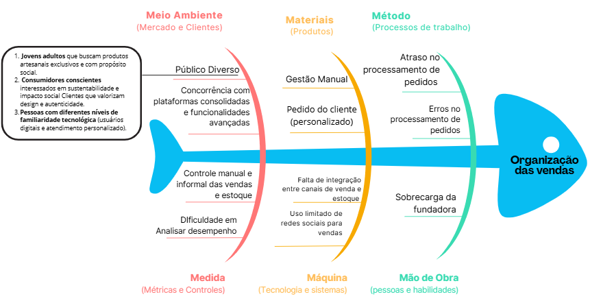
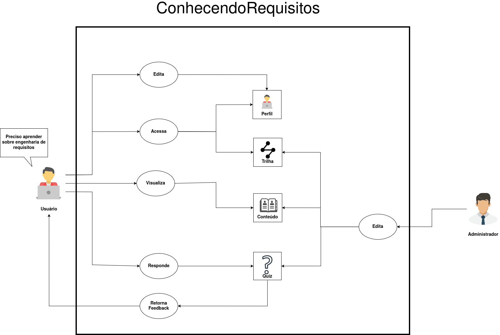
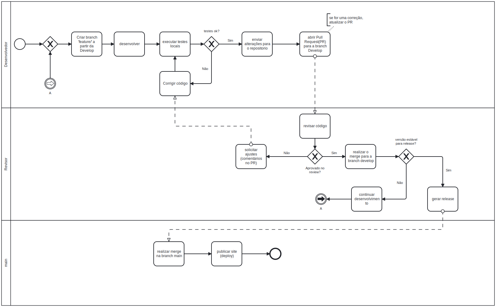

# ConhecendoRequisitos

**Código da Disciplina**: FGA0208 
**Número do Grupo**: 02 
**Entrega**: 01 

## Alunos
**Tabela 1:** Participantes da elaboração do cronograma

| Matrícula | Aluno              |
| --------- | ------------------ |
| 23/1027032 | Arthur Oliveira    |
| 19/0042303 | Carlos Nascimento  |
| 23/1037665 | Daniel Nascimento  |
| 22/2006650 | Davi Sousa         |
| 23/1026699 | Eduarda Rodrigues  |
| 23/1037692 | Isabella Choukaira |
| 23/1035455 | Leticia Jesus      |
| 20/0067095 | Lucas Avelar       |
| 23/1038303 | Yan Aguiar         |
| 23/1012316 | Yasmin Nascimento  |

## Sobre 

O ConhecendoRequisitos é uma plataforma educacional focada no ensino prático de Engenharia de Requisitos, desenvolvida no âmbito da disciplina de Arquitetura e Desenho de Software da Faculdade de Ciência e Tecnologia em Engenharias (FCTE-UnB). O projeto visa democratizar o acesso a conteúdos técnicos de forma ágil e intuitiva, combatendo a desmotivação gerada por materiais densos e estritamente teóricos. 

Através de uma estrutura baseada em trilhas de aprendizado e microlearning, a solução busca oferecer um ambiente de estudo assíncrono que se adapte à rotina fragmentada de estudantes que conciliam a graduação com estágios, permitindo a consolidação de conceitos fundamentais por meio de desafios interativos, quizzes de fixação e feedback educativo imediato.

## Screenshots da Primeira Entrega

### Diagrama de Ishikawa

### Rich Picture

### BPMN GitFlow

## Há algo a ser executado?

( ) SIM

(X) NÃO

## Informações Complementares 

Nenhuma informação complementar.

---

## Histórico de versões

| Versão | Data       | Descrição             | Autor                                            | Revisor |
| ------ | ---------- | --------------------- | ------------------------------------------------ | ------- |
| 1.0    | 05/04/2026 | Criação do documento | [Arthur Evangelista](https://github.com/arthurevg) |    [Yasmin Nascimento](https://github.com/Yasm1nNasc1mento)     |